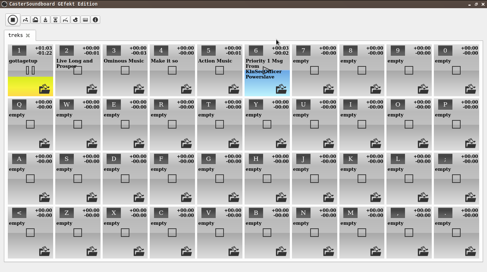

[](https://ko-fi.com/U7U51VFGK)

# CasterSoundboard GEfekt Edition

A fork from [CasterSondboard by JupiterBroadcasting](https://github.com/JupiterBroadcasting/CasterSoundboard), clean interface.

What is different from main version:

* removed all buttons except Open File.   
* removed volume scrollbar.   
* removed progress bar.  

But why?! Becasue I need soundboard to play sound. I do not want to edit (clip)
sound in it and I do not need fader in it. Editing sound should be done with
proper tools. Fading can be done with a mixer. The app should do only one thing:
play sound. By taking out all that is not esential for the application main
purpose I now have 40 players per tab even on 1366x768 screens.

The functionality is still there and you can have all this back if you want by
simply editing source and compile.



## Build from source

You can specify the target directory using the `PREFIX` `qmake` variable (default: `/usr`).

```
$ qmake PREFIX=/usr/local
```

Then run `make` to build the project:

```
$ make
```

And finally run `make install` to install the app:

```
# make install
```

Now you're good to go!
